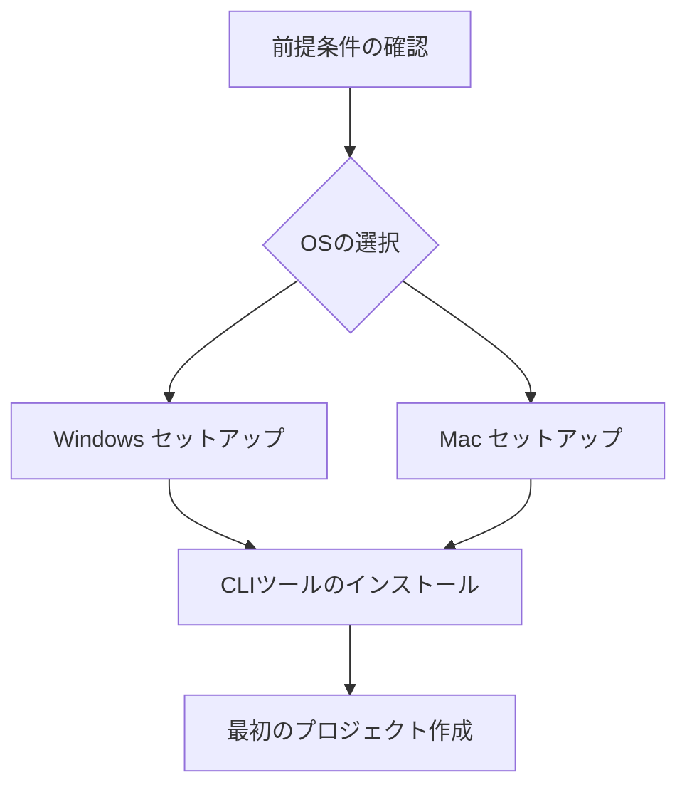

# 環境構築
{: .no_toc }

Vibecodingを使い始めるための環境構築ガイドです。お使いのOSに応じて、必要なツールをインストールしていきます。
{: .fs-6 .fw-300 }

## 目次
{: .no_toc .text-delta }

1. TOC
{:toc}

---

## 概要

Vibecodingの開発環境を構築するには、以下のステップを順番に進めていきます：

1. **前提条件の確認** - 必要なツールがインストールされているか確認
2. **OS別セットアップ** - WindowsまたはMacの環境に応じた設定
3. **プロジェクト作成** - 最初のVibecodingプロジェクトを作成

## 必要なツール

- **Node.js** v16.0以上
- **Git** v2.0以上
- **gemini-cli** （Node.js経由でインストール）
- **codex-cli** （Node.js経由でインストール）

## セットアップの流れ

## トラブルシューティング

環境構築で問題が発生した場合は、各ページの「トラブルシューティング」セクションを参照してください。

よくある問題：
- Node.jsのバージョンが古い
- npmの権限エラー
- Gitの初期設定が未完了

---

次のステップ: [前提条件の確認]({{ site.baseurl }}/getting-started/prerequisites/)から始めましょう。